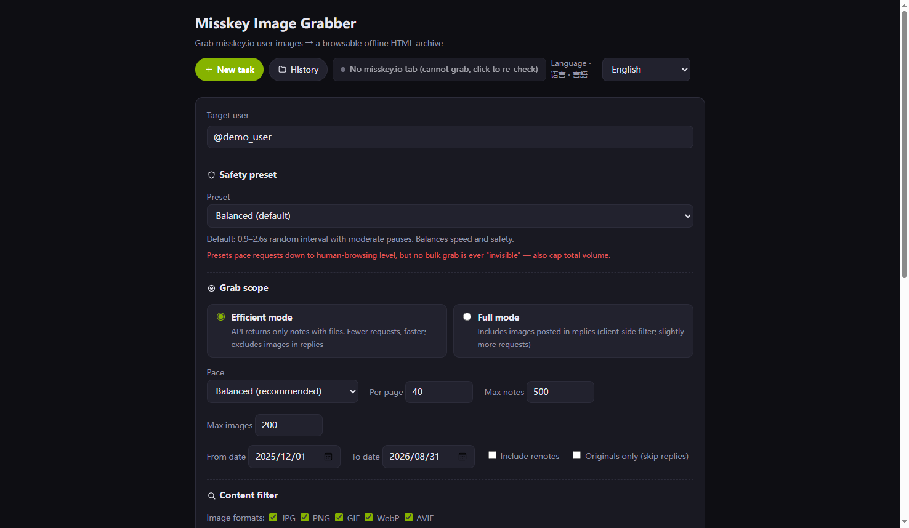
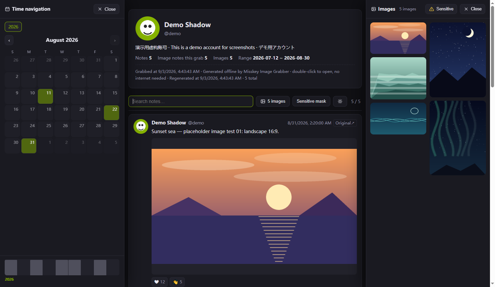

# Misskey Image Grabber

[中文](README.md) | [日本語](README.ja.md) | [English](README.en.md)

A Chrome / Edge (MV3) browser extension that grabs images posted by a misskey.io user and builds a **browsable offline single-user HTML timeline archive**.

> ⚠️ This is an **unofficial** community tool, not affiliated with Misskey or misskey.io.

**Manager page** — three safety presets, grab scope & content filters, naming rules and save location:



**Archive page** — timeline + time navigation (calendar / activity axis) on the left + media drawer on the right:



## Features

- **One-click grabbing**: press the injected button on any misskey.io user page. Efficient mode (posts with images only) and Full mode (including reply images) are both supported
- **Low-footprint design**: requests go through your own logged-in page context (same origin/session as normal browsing) with human-like randomized pacing, periodic long pauses, batch rests, and exponential backoff on rate limits. **It cannot and does not try to be "invisible"** — cap your volume with the built-in limits
- **Incremental archive**: repeated exports only download new images and keep merging into the same `archive.html`
- **Six export modes**: update local archive (main path) / HTML snapshot ZIP / folder snapshot / single-file HTML (images embedded) / images-only ZIP / metadata (JSON+CSV)
- **Offline archive page**: media drawer grid, lightbox (wheel to switch), calendar & activity timeline navigation, full-text search, sensitive-content blur (misskey-style CSS), dark/light themes, tri-lingual UI (EN/JA/ZH)
- **Download history**: history table, JSON import/export, on-disk library scan, and archive HTML rebuild without extension records

## Install (developer mode)

1. Download this repository (Code → Download ZIP, or `git clone`)
2. Open `edge://extensions` (Edge) or `chrome://extensions` (Chrome)
3. Enable "Developer mode"
4. Click "Load unpacked" and select the repository folder (the level containing `manifest.json`)
5. Click the extension icon to finish onboarding, then open any misskey.io user page and press the green "Grab" button

> Edge/Chrome 100+ recommended (File System Access API may require a newer version; the extension falls back automatically).

## Permissions

| Permission | Purpose |
|------|------|
| `downloads` | Save images and archive files to the downloads folder / a chosen folder |
| `storage` | Store extension settings and download history (local only) |
| `unlimitedStorage` | Support history data of large grabs |
| `tabs` | Open the manager page and detect misskey.io tabs to reuse the login session |
| Host: `misskey.io`, `*.misskeyusercontent.jp` | Call the misskey.io API (relayed through your own logged-in page); download image CDN assets |

## Privacy & Data

- All grabbed data, images and the login token **stay on your computer** (browser extension storage) and are **never sent to any third-party server**
- The login token is only used to call the misskey.io API as yourself — equivalent to your own browsing requests
- No analytics, telemetry or remote code is included

## Disclaimer

For **personal backup and archiving** only. Follow the misskey.io instance rules, keep your crawl volume and frequency reasonable; all grabbed data and images belong to their original authors. Use at your own risk.

## Development

```bash
# Syntax-check all sources
node --check lib/*.js

# Run the 25 unit/regression tests (zero dependencies, Node 18+)
cd test && node test.mjs
```

- `lib/` pure logic layer: no chrome API dependency, directly testable in Node
- `content.js`: content script injected into misskey.io (grab button / token collection / API relay)
- `background.js`: MV3 service worker (extension page routing)
- `manager/`, `onboarding/`: extension manager page and start page

## License

[MIT](LICENSE) · misskey.io and its content are unrelated to this project; all data belongs to its original authors.
