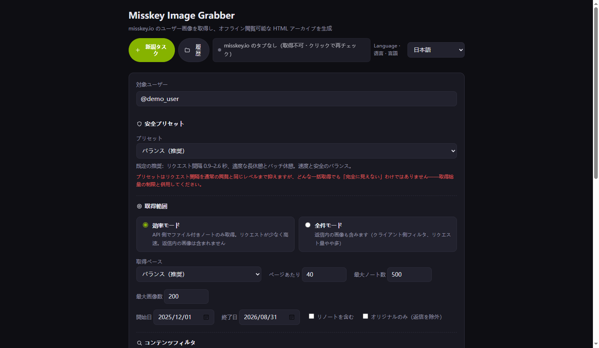
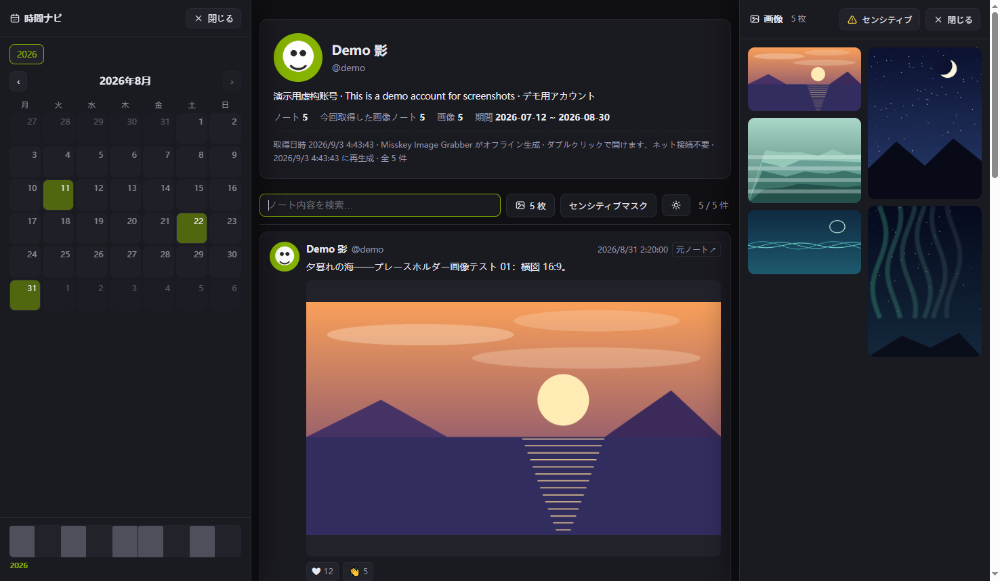

# Misskey Image Grabber

[中文](README.md) | [日本語](README.ja.md) | [English](README.en.md)

Chrome / Edge（MV3）拡張機能：misskey.io のユーザーが投稿した画像を取得し、**オフラインで閲覧できる単一ユーザーの HTML タイムラインアーカイブ**を生成します。

> ⚠️ 本拡張機能は**非公式**のコミュニティツールです。Misskey および misskey.io とは関係ありません。

**管理ページ** —— 3 段階の安全プリセット、取得範囲とコンテンツフィルター、命名規則と保存先：



**アーカイブページ** —— タイムライン + 左側の時間ナビ（カレンダー / アクティビティ軸）+ 右側のメディアドロワー：



## 機能

- **ワンクリック取得**：misskey.io のユーザーページで注入ボタンを押すだけ。効率モード（画像付きノートのみ）とフルモード（リプライの画像も含む）に対応
- **低検知設計**：リクエストはログイン済みページのコンテキスト経由で送信（通常閲覧と同一オリジン/セッション）。人間らしいランダム間隔・定期的な長休憩・バッチ休憩、レート制限時は自動で指数バックオフ。**「完全に不可視」にはなりません**。上限設定で総量を管理してください
- **増分アーカイブ**：再書き出し時は新規画像のみダウンロードし、同じ `archive.html` に統合
- **6 種類の書き出し**：ローカルアーカイブ更新（メイン）/ HTML スナップショット ZIP / フォルダスナップショット / 単一ファイル HTML（画像埋め込み）/ 画像のみ ZIP / メタデータ（JSON+CSV）
- **オフラインアーカイブページ**：メディアドロワー、ライトボックス（ホイール切替）、カレンダーとアクティビティ軸ナビ、全文検索、センシティブマスク（misskey 式 CSS ブラー）、ダーク/ライトテーマ、日英中 3 言語 UI
- **取得履歴**：履歴一覧、記録 JSON の入出力、ディスクからのスキャン復元、拡張機能の記録なしでアーカイブ HTML を再構築

## インストール（開発者モード）

1. このリポジトリをダウンロード（Code → Download ZIP、または `git clone`）
2. `edge://extensions`（Edge）/ `chrome://extensions`（Chrome）を開く
3. 「開発者モード」を有効化
4. 「展開されていない拡張機能を読み込む」でリポジトリのディレクトリ（`manifest.json` のある階層）を選択
5. ツールバーの拡張機能アイコンから初期化し、misskey.io のユーザーページを開いて右下の緑の「取得」ボタンをクリック

> Edge/Chrome 100 以上を推奨（File System Access API 使用時はより新しいバージョンが必要な場合があります。拡張機能は自動でフォールバックします）。

## 権限の説明

| 権限 | 用途 |
|------|------|
| `downloads` | 画像とアーカイブファイルをダウンロードフォルダ / 選択フォルダに保存 |
| `storage` | 拡張機能の設定と取得履歴を保存（ローカルのみ） |
| `unlimitedStorage` | 大量取得時の履歴データを保存 |
| `tabs` | 拡張機能ページを開く、misskey.io タブを検出してログインセッションを再利用 |
| ホスト権限：`misskey.io`、`*.misskeyusercontent.jp` | misskey.io API へのリクエスト（自分のログインページ経由）、画像 CDN のダウンロード |

## プライバシーとデータ

- 取得したデータ・画像・ログイントークンは**すべてローカルに保存**され、**第三者のサーバーへ送信されません**
- ログイントークンは、あなた自身のリクエストと同等の misskey.io API 呼び出しにのみ使用されます
- 本拡張機能にアナリティクス・テレメトリ・リモートコードは含まれません

## 免責事項

本ツールは**個人のバックアップとアーカイブ**目的のみに使用してください。misskey.io のインスタンスルールを守り、取得量と頻度を控えめに。データと画像の著作権は各作者に帰属します。使用による一切の結果は利用者が負います。

## 開発

```bash
# 全ソースファイルの構文チェック
node --check lib/*.js

# 25 項目のユニット/回帰テスト実行（依存なし、Node 18+）
cd test && node test.mjs
```

- `lib/`：chrome API に依存しない純粋ロジック層（Node でテスト可能）
- `content.js`：misskey.io に注入されるコンテンツスクリプト（取得ボタン / トークン収集 / API 中継）
- `background.js`：MV3 service worker（拡張ページルーティング）
- `manager/`、`onboarding/`：拡張機能の管理ページとスタートページ

## ライセンス

[MIT](LICENSE) · misskey.io およびそのコンテンツは本プロジェクトと無関係で、データの著作権は各作者に帰属します。
