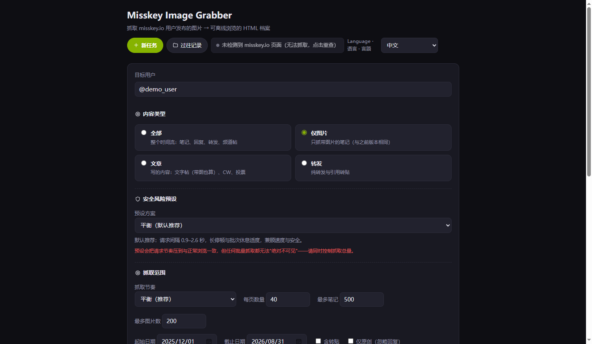
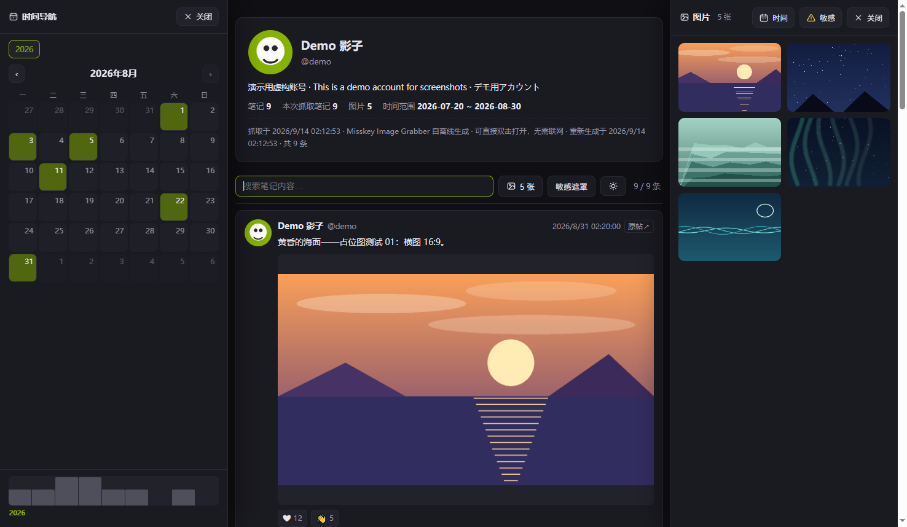

# Misskey Image Grabber

[中文](README.md) | [日本語](README.ja.md) | [English](README.en.md)

一款 Chrome / Edge（MV3）浏览器扩展：抓取 misskey.io 用户发布的图片，生成**可离线浏览的单用户 HTML 时间线档案**。

> ⚠️ 本扩展为**非官方**的社区工具，与 Misskey 或 misskey.io 无隶属关系。

**管理页** —— 三档安全预设、抓取范围与内容过滤、命名规则与保存位置：



**档案页** —— 时间线 + 左侧时间导航（月历 / 活跃度轴）+ 右侧媒体抽屉：



## 功能

- **一键抓取**：在 misskey.io 用户主页点击注入按钮即可开始；支持高效模式（仅含图帖子）与全覆盖模式（含回复图片）
- **低风控设计**：请求经由你已登录的页面上下文发出（与正常浏览同源同会话），拟人化随机间隔、周期性长停顿、批次休息，限流自动指数退避；**无法也不试图做到"绝对不可见"**，请配合数量上限控制总量
- **增量档案**：重复导出只下载新图片，持续合并进同一份 `archive.html`
- **六种导出**：更新本地档案（主路径）/ HTML 快照 ZIP / 文件夹快照 / 单文件 HTML（图片内嵌）/ 纯图片 ZIP / 元数据（JSON+CSV）
- **离线档案页**：瀑布流媒体抽屉、灯箱（滚轮切图）、日历与活跃度时间轴导航、全文搜索、敏感内容遮罩（misskey 式 CSS 模糊）、深浅主题、三语界面（中/日/英）
- **过往记录**：下载历史一览、记录 JSON 导入导出、从磁盘扫描重建、无需扩展记录即可重建档案 HTML

## 安装（开发者模式）

1. 下载本仓库（Code → Download ZIP，或 `git clone`）
2. 浏览器打开 `edge://extensions`（Edge）或 `chrome://extensions`（Chrome）
3. 开启「开发人员模式」
4. 点「加载解压缩的扩展」，选择本仓库目录（含 `manifest.json` 的那一层）
5. 点击工具栏中的扩展图标完成初始化，然后打开 misskey.io 任意用户主页，点右下角的绿色「抓取」按钮

> 需要 Edge/Chrome 100 以上版本（使用 File System Access API 时要求更高版本，扩展会自动降级）。

## 权限说明

| 权限 | 用途 |
|------|------|
| `downloads` | 将图片与档案文件保存到下载文件夹 / 自选文件夹 |
| `storage` | 保存扩展设置与下载历史（仅本机） |
| `unlimitedStorage` | 支撑大批量抓取的历史数据 |
| `tabs` | 打开扩展管理页、检测 misskey.io 标签以复用登录会话 |
| 主机权限：`misskey.io`、`*.misskeyusercontent.jp` | 向 misskey.io API 发起请求（经你自己的登录页面中继）；下载图片 CDN 资源 |

## 隐私与数据

- 所有抓取的数据、图片、登录 token **仅保存在你的电脑本地**（浏览器扩展存储），**不向任何第三方服务器发送**
- 登录 token 仅用于以你的身份调用 misskey.io API（等价于你自己浏览时的请求）
- 本扩展不包含任何分析统计、遥测或远程代码

## 免责声明

本工具仅供**个人备份与存档**使用。请遵守 misskey.io 实例规则，控制抓取量级与频率；抓取的数据与图片版权归原作者所有。使用本软件产生的任何后果由使用者自行承担。

## 开发

```bash
# 语法检查（全部源文件）
node --check lib/*.js

# 运行 25 项单元/回归测试（零依赖，Node 18+）
cd test && node test.mjs
```

- `lib/` 纯逻辑层：不依赖 chrome API，可在 Node 中直接测试
- `content.js`：注入 misskey.io 的内容脚本（抓取按钮 / token 采集 / API 同源中继）
- `background.js`：MV3 service worker（扩展页路由）
- `manager/`、`onboarding/`：扩展管理页与启动页

## 授权

[MIT](LICENSE) · misskey.io 及其内容与本项目无隶属关系，数据版权归各原作者所有。
